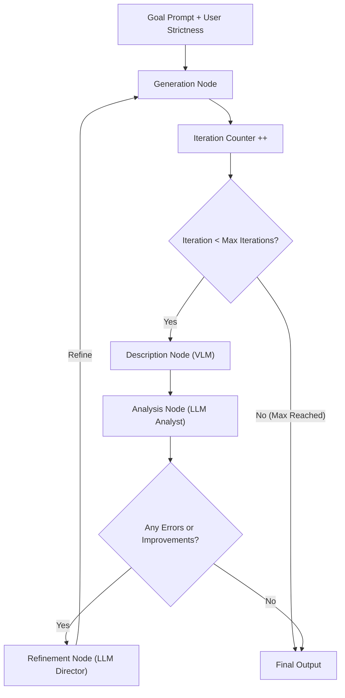
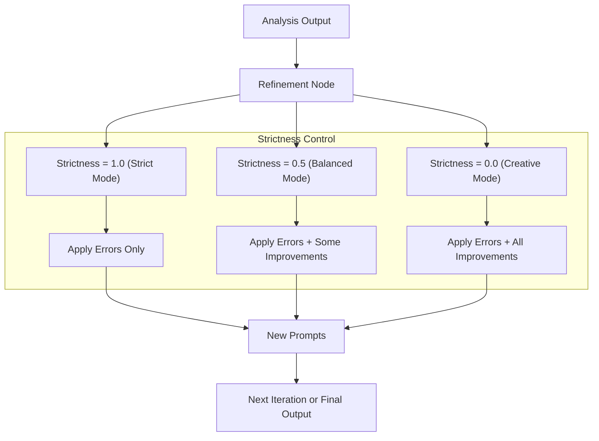

# GIRL
A closed-loop prompt refinement workflow (Generate → Identify → Refine → Loop) for faithful and flexible AI image generation.

## GIRL: Generate → Identify → Refine → Loop  
*A Closed-Loop Prompt Refinement Workflow for Image Generation in ComfyUI*  

---

## Abstract  
**GIRL** (Generate → Identify → Refine → Loop) is a **closed-loop prompt refinement** workflow designed for AI image generation.  

It leverages both a **Vision-Language Model (VLM)** and a **Large Language Model (LLM)** to automatically:  
1. Generate an image.  
2. Identify mismatches between the user’s goal and the actual output.  
3. Refine the prompt while respecting user-specified flexibility.  
4. Loop until alignment is achieved, optionally applying stylistic enhancements.  

This approach is inspired by **Test-time Prompt Refinement (TIR)** and **RefineEdit-Agent**, but is designed to be:  
- **Lightweight**  
- **JSON-driven**  
- **Directly implementable in ComfyUI**  

---

## The Problem  
- Novice prompters often give **ambiguous or underspecified prompts**.  
- Image models silently **assume details** (e.g., “dog = retriever, park = daylight”), which may not match intent.  
- Trial-and-error corrections require prompting expertise.  

---

## The GIRL Solution: Closed-Loop Prompt Refinement  
GIRL ensures that generated outputs **stay faithful to the original prompt** while letting users control how much creativity is introduced.  

### Steps in GIRL:  
- **Generate** → Image from current prompt.  
- **Identify** → VLM + Analyst find mismatches (errors) and optional refinements.  
- **Refine** → Director updates positive/negative prompts.  
- **Loop** → Continue until aligned or user stops.  

---
🔄 Main GIRL Workflow


🎚️ Strictness Influence on Refinement

---

## Ambiguity Handling in GIRL  

Unlike one-shot prompting, GIRL **does not invent missing details** unless the user explicitly allows it.  

- **Errors** → Always fixed (faithfulness to prompt).  
- **Improvements** → Only applied if the user’s strictness allows.


### Example A: Dog in a Park  

**Goal Prompt:**

"A boy with a dog in a park"

- **Strict Mode (strictness = 1.0)** → System only ensures “boy + dog + park.” No assumptions.  
- **Balanced Mode (strictness = 0.5)** → Might add “surreal contrast between boy and dog.”  
- **Creative Mode (strictness = 0.0)** → Could add “sunset atmosphere” or “make the dog a retriever.”  

✅ The user, not the model, decides how far refinements may go.  

---

### Example B: Apple Reflection  

**Goal Prompt:**

"A single red apple reflected in both a still pond and a broken mirror"

- **Iteration 1 Output** → Reflection is wavy.  
  - Error detected: “Expected still pond.”  
- **Iteration 2 Output** → Still pond achieved. No errors.  
  - Improvements suggested: “cinematic lighting,” “emphasize surreal contrast.”  

- With **strictness = 1.0** → Only errors fixed. Final = plain apple.  
- With **strictness = 0.5** → Adds surreal contrast.  
- With **strictness = 0.0** → Adds both surreal contrast + cinematic lighting.  

---

## Unified JSON Schema  

```json
{
  "goal_prompt": "string",
  "refinement_control": {
    "strictness": 0.8,               // User-chosen, 0.0 = creative, 1.0 = strict
    "apply_improvements": true,
    "apply_errors": true
  },
  "metadata": {
    "session_id": "uuid",
    "created_at": "timestamp"
  },
  "current_iteration": {
    "iteration": 2,
    "positive_prompt": "string",
    "negative_prompt": "string",
    "generated_image": "uri_or_id",
    "generated_description": "string",
    "analysis": {
      "errors": [
        {
          "field": "string",
          "issue": "string",
          "expected": "string"
        }
      ],
      "improvements": [
        {
          "field": "string",
          "suggestion": "string"
        }
      ]
    },
    "status": {
      "stage": "generation|description|analysis|refinement|complete",
      "complete": false
    }
  },
  "history": [
    {
      "iteration": 1,
      "positive_prompt": "string",
      "errors": 1
    }
  ],
  "future_extensions": {
    "multi_goal_support": [ { "sub_goal": "string", "status": "pending|done" } ],
    "style_critics": [ { "critic": "name", "feedback": "string" } ],
    "metrics": {
      "alignment_score": "float",
      "aesthetic_score": "float",
      "clip_score": "float"
    },
    "user_overrides": [ { "iteration": 2, "override": "force nighttime setting" } ]
  }
}
```
---

## Comparison to Related Work
## 7. Comparison to Related Work  

| Framework / Tool            | Similarities                                    | Differences from GIRL                                |
|-----------------------------|------------------------------------------------|-----------------------------------------------------|
| **TIR (Test-time Prompt Refinement)** | Iterative correction loop, uses multimodal analysis. | Academic prototype only; GIRL is JSON-driven, modular, and user-controllable. |
| **RefineEdit-Agent**        | Multi-agent closed-loop refinement (LLM + VLM). | Focused on fine-grained editing; GIRL targets whole-prompt alignment and ambiguity handling. |
| **ComfyGen / Prompt-Master** | Use LLMs for automatic prompt generation/refinement. | No image-based evaluation or closed feedback loop. |


---
## Future Directions

- Metrics Integration (CLIP, aesthetics).
- Multi-goal decomposition for complex prompts.
- Specialized critics for style realism, surrealism, etc.
- Two-tier history (recent detailed, older summarized).
- Human-in-the-loop overrides.

---
## Summary

GIRL (Generate → Identify → Refine → Loop) is a closed-loop prompt refinement framework for AI image generation.

Faithful → Always satisfies the original prompt.

Flexible → User strictness controls how much creativity is applied.

Transparent → JSON structure tracks every iteration, making debugging and extension easy.

Practical → Designed for ComfyUI node chains, but general enough for any modular pipeline.


With GIRL, novice prompters get reliable results, and experts get fine-tuned control over the balance between faithfulness and creativity.


---


