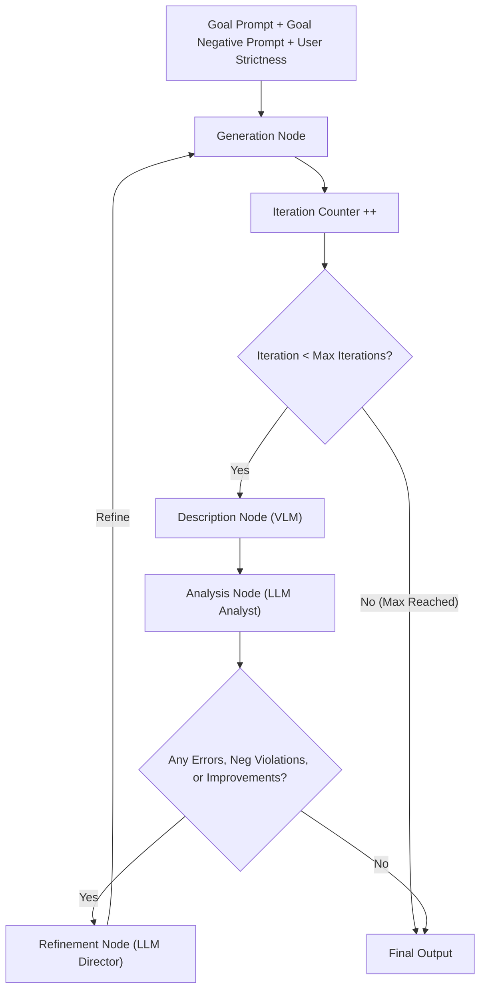
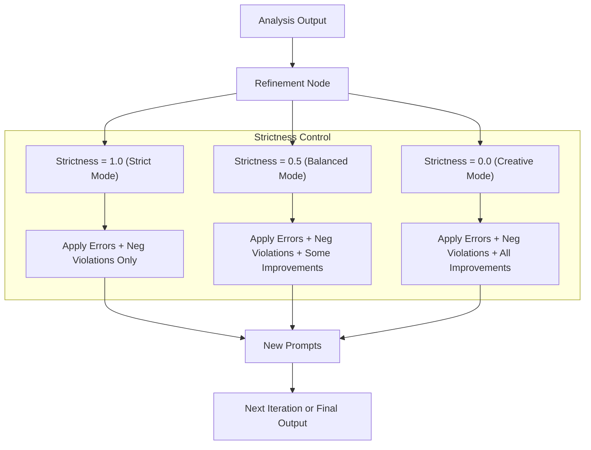

# **Work In Progress - actual usable workflow and code coming**

# GIRL
A closed-loop prompt refinement workflow (Generate → Identify → Refine → Loop) for faithful and flexible AI image generation.

## GIRL: Generate → Identify → Refine → Loop  
*A Closed-Loop Prompt Refinement Workflow for Image Generation*  

---

## Abstract  
**GIRL** (Generate → Identify → Refine → Loop) is a **closed-loop prompt refinement** workflow designed for AI image generation.  

It leverages both a **Vision-Language Model (VLM)** and a **Large Language Model (LLM)** to automatically:  
1. Generate an image.  
2. Identify mismatches between the user’s goal and the actual output.  
3. Refine the prompt while respecting user-specified flexibility.  
4. Loop until alignment is achieved, optionally applying stylistic enhancements.  

This approach is inspired by **Test-time Prompt Refinement (TIR)** and **RefineEdit-Agent**, but is designed to be:  
- **Lightweight**  
- **JSON-driven**  
- **Directly implementable in node-based workflows (e.g., ComfyUI)**  

---

## The Problem  
- Novice prompters often give **ambiguous or underspecified prompts**.  
- Image models silently **assume details** (e.g., “dog = retriever, park = daylight”), which may not match intent.  
- Trial-and-error corrections require prompting expertise.  
- Negative intent (things the user **doesn’t want**) is often overlooked until too late.  

---

## The GIRL Solution: Closed-Loop Prompt Refinement  
GIRL ensures that generated outputs **stay faithful to both positive and negative prompts** while letting users control how much creativity is introduced.  

### Steps in GIRL:  
- **Generate** → Image from current prompt + goal negative prompt.  
- **Identify** → VLM + Analyst find mismatches (errors), violations of the negative prompt, and optional refinements.  
- **Refine** → Director updates positive/negative prompts.  
- **Loop** → Continue until aligned or user stops.  

---

### Main GIRL Workflow

### Strictness Influence on Refinement


---

### Ambiguity & Negatives in GIRL

Unlike one-shot prompting, GIRL does not invent missing details unless the user explicitly allows it. It also protects against undesired outputs by enforcing a goal negative prompt across all iterations.

Errors → Always fixed (faithfulness to prompt).

Negative Prompt Violations → Always fixed immediately.

Improvements → Only applied if the user’s strictness allows.


---

## Examples

### Example A: Dog in a Park

Goal Prompt:
"A boy with a dog in a park"

Goal Negative Prompt:
"no extra people, no text, no logos"

Strict Mode (1.0) → Ensures only “boy + dog + park,” removes any extra people if detected.

Balanced Mode (0.5) → Might add “surreal contrast between boy and dog.”

Creative Mode (0.0) → Could add “sunset atmosphere” or “make the dog a retriever.”


The user decides how far refinements may go, but negatives are always respected.


---

### Example B: Apple Reflection

Goal Prompt:
"A single red apple reflected in both a still pond and a broken mirror"

Goal Negative Prompt:
"no multiple apples, no text, no surreal creatures"

Iteration 1 Output → Reflection is wavy.

Error detected: “Expected still pond.”


Iteration 2 Output → Still pond achieved. No errors.

Improvements suggested: “cinematic lighting,” “emphasize surreal contrast.”

Negative check: No violations.


With strictness = 1.0 → Only errors fixed, negatives enforced. Final = plain apple.

With strictness = 0.5 → Adds surreal contrast.

With strictness = 0.0 → Adds both surreal contrast + cinematic lighting.


---

## Unified JSON Schema
```json
{
  "goal_prompt": "string",
  "goal_negative_prompt": "string",
  "refinement_control": {
    "strictness": 0.8,               
    "apply_improvements": true,
    "apply_errors": true
  },
  "metadata": {
    "session_id": "uuid",
    "created_at": "timestamp"
  },
  "current_iteration": {
    "iteration": 2,
    "positive_prompt": "string",
    "negative_prompt": "string",
    "generated_image": "uri_or_id",
    "generated_description": "string",
    "analysis": {
      "errors": [
        { "field": "string", "issue": "string", "expected": "string" }
      ],
      "negative_violations": [
        { "violation": "string", "detected": true }
      ],
      "improvements": [
        { "field": "string", "suggestion": "string" }
      ]
    },
    "status": {
      "stage": "generation|description|analysis|refinement|complete",
      "complete": false
    }
  },
  "history": []
}
```
---

## Comparison to Related Work

| Framework / Tool | Similarities | Differences |
|---|---|---|
| TIR (Test-time Prompt Refinement) | Iterative correction loop with multimodal analysis. | Academic prototype only; GIRL is JSON-driven, modular, and user-controllable. |
| RefineEdit-Agent | Multi-agent closed-loop refinement (LLM + VLM). | Focused on fine-grained editing; GIRL targets whole-prompt alignment, with strictness + negatives. |
| ComfyGen / Prompt-Master | Use LLMs for automatic prompt generation/refinement. | No image-based evaluation, negative enforcement, or iterative feedback loop. |

---

## Future Directions

- Metrics Integration (CLIP, aesthetics).
- Multi-goal decomposition for complex prompts.
- Specialized critics for style realism, surrealism, etc.
- Two-tier history (recent detailed, older summarized).
- Human-in-the-loop overrides.
---

Summary

GIRL (Generate → Identify → Refine → Loop) is a closed-loop prompt refinement framework for AI image generation.

Faithful → Always satisfies both positive and negative goals.

Flexible → User strictness controls how much creativity is applied.

Transparent → JSON structure tracks every iteration, making debugging and extension easy.

Practical → Designed for modular node workflows, adaptable beyond ComfyUI.


With GIRL, novice prompters get reliable results, and experts get fine-tuned control over the balance between faithfulness and creativity — while ensuring undesired outputs never sneak in.


---


